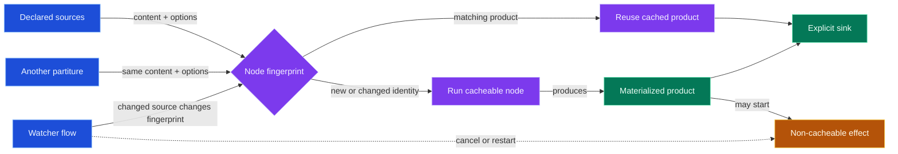

# Ballad

Ballad turns a Moonstone project into explicit, inspectable release outputs.
Write a small Lua **partiture** that declares the source, transforms, and sinks;
Ballad plans the graph, reuses cacheable work, and materializes the result.

## Install

```sh
moon add moonstone/ballad --tool
moon exec ballad --help
```

## Export a CLI

Create `partiture.lua` in a synchronized Moonstone project:

```lua
local ballad = require("ballad")

return ballad.partiture(function(p)
  local moonstone = p:use(ballad.plugins.moonstone)
  local layout = p:use(ballad.plugins.layout)

  local project = moonstone.project({ root = "." })
  local app = layout.exec(project, {
    name = project.name,
    entry = "src/main.lua",
    bin = project.name,
    interpreter = "lua",
  })

  p.sink.directory(app, { out = "dist" })
end)
```

```sh
moon sync
moon exec ballad play partiture.lua
```



## Why the graph matters

- **Inputs identify work.** A node fingerprint includes its declared inputs and
  options. Change either one and Ballad runs that node again.
- **Products cross flow boundaries.** A release partiture and a watcher
  partiture can reuse the same build product when their complete fingerprints
  match; cache ownership is not tied to the file that declared the node.
- **Effects stay effects.** Starting a server, publishing, and watcher cleanup
  are non-cacheable. Cancelling an effect does not corrupt or invalidate a
  valid build product; the next flow can reuse it or build a new product when
  its inputs changed.
- **Sinks make delivery reviewable.** File graphs and artifacts provide a
  concrete record of what the release produced.

Use `moonstone.registry.package(...)` when the graph should also produce a
Moonstone Registry artifact. The repository contains deeper architecture,
plugin, and release documentation.
