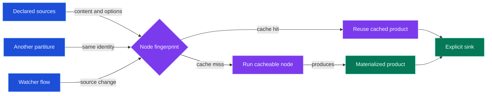
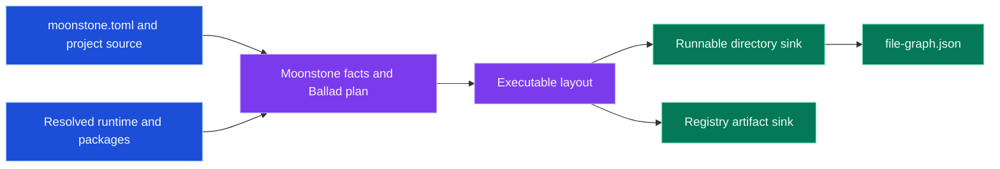
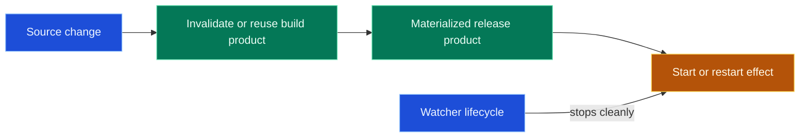

# Ballad

Ballad turns a Moonstone project into an explicit release graph. A small Lua
**partiture** declares inputs, transformations, and sinks; Ballad fingerprints
cacheable work, materializes the products, and leaves non-cacheable effects
such as publishing or a running process explicit.

## Quick start: export a CLI

Install Ballad as a project tool, then create a Lua entrypoint and a
`partiture.lua` beside `moonstone.toml`.

```sh
moon add moonstone/ballad --tool
moon sync
mkdir -p src
printf 'print("Hello from Ballad")\n' > src/main.lua
```

```lua
local ballad = require("ballad")

return ballad.partiture(function(p)
  local moonstone = p:use(ballad.plugins.moonstone)
  local layout = p:use(ballad.plugins.layout)

  local project = moonstone.project({ root = "." })
  local app = layout.exec(project, {
    name = project.name,
    bin = project.name,
    entry = "src/main.lua",
    interpreter = "lua",
  })

  p.sink.directory(app, {
    out = "dist/" .. project.name,
    file_graph = true,
  })
end)
```

```sh
moon exec ballad play partiture.lua
./dist/<project-name>/bin/<project-name>
```

The release is an inspectable closure, not a pile of incidental build files:

```text
dist/<project-name>/
├── bin/<project-name>          # portable launcher
├── libexec/<project-name>/     # entrypoint, project files, runtime closure
└── file-graph.json             # every emitted file and its origin
```

## Why the graph matters

Two partitures can reuse the same product when their complete node identity
matches. Cache ownership belongs to the work and its declared facts, not to one
partiture file.



## Package a registry artifact

Add one explicit artifact sink when the same graph should produce a Moonstone
registry package as well as a runnable directory.

```lua
local artifact = moonstone.registry.package(app, {
  name = project.registry_name or project.name,
  version = project.version,
})

p.sink.artifact(artifact, {
  out = "dist/registry-artifact",
})
```



This keeps the release contract reviewable: the directory is useful to a human
or deployment system, while the artifact carries the package descriptor and
immutable payload for the registry.

## Watch products, not daemons

Ballad can watch source changes and run an effect after a product exists. The
build remains the reusable value; a server handoff, restart, or publication is
an intentionally non-cacheable effect.



Use Ballad's layout, registry, watcher, native-task, and orbit APIs to compose
larger releases deliberately. The repository `README.md` documents the full
partiture API and development workflow; the Moonstone docs provide guided
examples for CLI exports, orbit composition, and release closures.
